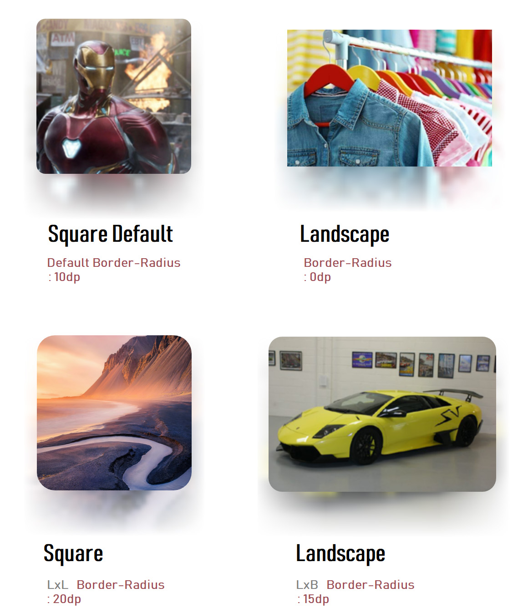
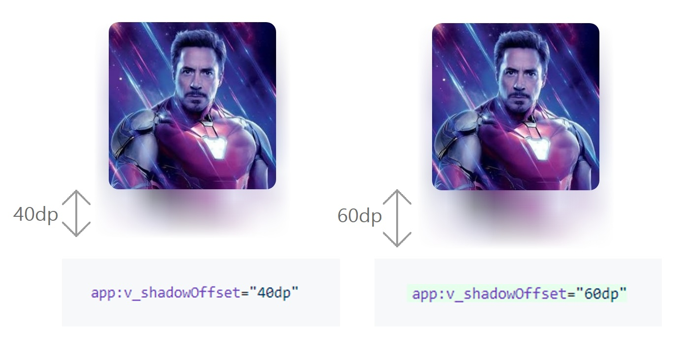

<h2 align="center">  </h2>

<p align="center">
 
 <a href="https://android.com">
    
  </a>
  
  <a href="https://developer.android.com/about/versions/android-4.0.html">
    
  </a>
  
  <a href="https://jitpack.io/#virtualvivek/BlurShadowImageView">
    
  </a>
  
  <a href="https://github.com/virtualvivek/BlurShadowImageView/blob/master/library/src/main/java/me/virtualiz/blurshadowimageview/BlurShadowImageView.java">
    
  </a>
 
  
  <a href="https://developer.android.com/about/versions/android-4.0.html">
    
  </a>
  

  
</p>

<p align="center">This library provides blurred drop shadows to <b>ImageView</b> similar to <code>iOS backdrop shadows</code>.Provides fast canvas draw as no renderscript needed .The similar shadow blurred effects can also be seen in <i>iOS Music App.</i></p>

<p align="center"> </p> 

## Download Demo App

Download the demo app <code><b>.apk</b></code> file here 

<a href="apk/BlurShadow.apk">
</a>
      
## Scan to Download      


​
## Installation
Add it in your root build.gradle at the end of repositories :
```js
allprojects {
		repositories {
			...
			maven { url 'https://jitpack.io' }
		}
	}
 ```

Add the following dependency to your app build.gradle file :
```js
dependencies {
	        implementation 'com.github.virtualvivek:BlurShadowImageView:1.12'
	}
 ```

​
## How to use   
### Using Xml to config
```xml

 <me.virtualiz.blurshadowimageview.BlurShadowImageView
                android:layout_width="200dp"
                android:layout_height="220dp"
                android:layout_gravity="center"
                app:v_shadowOffset="40dp"
                app:v_imageRound="20dp"
                app:v_imageSrc="@drawable/nature" />
```

###  Use Java code to config
```js
BlurShadowImageView blurshadowimageview = (BlurShadowImageView)findViewById(R.id.blurSImageView);

//Sets Border Round Radius
blurshadowimageview.setRound((int) value);  

//Sets Image Resource
blurshadowimageview.setImageResource(ImgRes);  

//Sets Image Drawable
blurshadowimageview.setImageDrawable(drawable);  

//Sets Image Bitmap
blurshadowimageview.setImageBitmap(bitmap);  

```

​
##  Load image with Picasso


```js
 Picasso.with(getBaseContext())
	 .load("https://i.imgur.com/DvpvklR.png")
	 .into(new Target() {
    @Override
    public void onBitmapLoaded(Bitmap bitmap, Picasso.LoadedFrom loadedFrom) {
	demo_img.setImageBitmap(bitmap);
    }

    @Override
    public void onBitmapFailed(Drawable drawable) {
	//on failed do something
    }

    @Override
    public void onPrepareLoad(Drawable drawable) {
	//on prepare loading do something
    }
});			
```


​
## Image Blur Backdrop Offset



<p align="right"><br><br><br><br><br><br><br><br><br><br><br><br></p>


​
## Documentation 

 |Name|Format|Default|Details|
 |:---:|:---:|:---:|:---:|
 |app:v_imageSrc    |reference|image|sets image to the ImageView|
 |app:v_imageRound  |dimension|10dp|sets border radius to the ImageView|
 |app:v_shadowOffset|dimension|40dp|configure the distance between the Image and the Shadow|
 

## License

BlurShadowImageView is licensed under `MIT license`. View [license](https://github.com/virtualvivek/BlurShadowImageView/blob/master/LICENSE).<br>
Copyright (c) 2020 ` Vivek Verma .`
