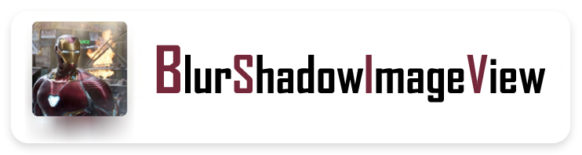
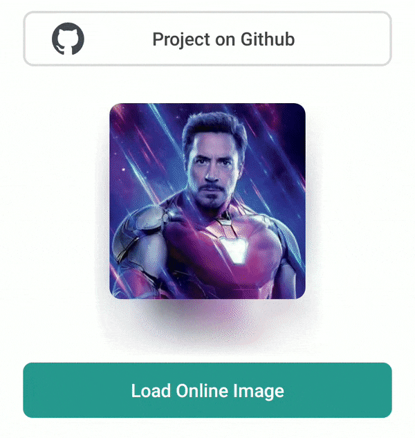
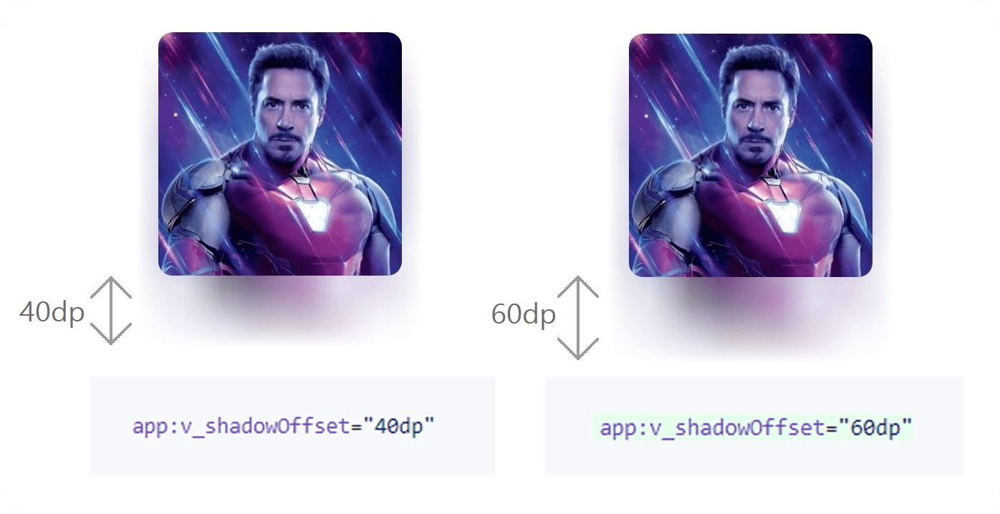

<h2 align="center">  </h2>

<p align="center">
 
 <a href="https://android.com">
    
  </a>
  
  <a href="https://developer.android.com/about/versions/android-5.0.html">
    
  </a>
  
  <a href="https://jitpack.io/#virtualvivek/BlurShadowImageView">
    
  </a>
  
  <a href="https://www.codacy.com/gh/virtualvivek/BlurShadowImageView/dashboard?utm_source=github.com&amp;utm_medium=referral&amp;utm_content=virtualvivek/BlurShadowImageView&amp;utm_campaign=Badge_Grade">
    
  </a>
  
  <a href="https://github.com/virtualvivek/BlurShadowImageView/blob/master/library/src/main/java/me/virtualiz/blurshadowimageview/BlurShadowImageView.java">
    
  </a>
  
</p>


<p align="center">This library provides blurred drop shadows to <b>ImageView</b> similar to <code>iOS backdrop shadows</code>.Provides fast canvas draw as <b>no renderscript</b> needed .The similar shadow blurred effects can also be seen in <i>iOS Music App.</i></p>

<p align="center"> </p> 

# Download Demo App

Download the demo app <code><b>.apk</b></code> file here

<a href="apk/BlurShadow.apk">
</a>
      
## Scan to Download


# Installation
Add it in your root build.gradle at the end of repositories :
```gradle
 allprojects {
     repositories {
         ...
	 maven { url 'https://jitpack.io' }
	  }
	}
 ```

Add the following dependency to your app build.gradle file :
```gradle
 dependencies {
     implementation 'com.github.virtualvivek:BlurShadowImageView:4.0'
	}
 ```

# How to use
## Using Xml to config

```xml
 <me.virtualiz.blurshadowimageview.BlurShadowImageView
     android:layout_width="200dp"
     android:layout_height="200dp"
     android:layout_gravity="center"
     android:scaleType="centerCrop"
     app:v_shadowOffset="40dp"
     app:v_imageRound="20dp"
     app:v_imageSrc="@drawable/nature" />
```

##  Use Java code to config
```js
BlurShadowImageView blurshadowimageview = findViewById(R.id.blurSImageView);

//Sets Border Round Radius
blurshadowimageview.setRound((int) value);

//Sets Image Resource
blurshadowimageview.setImageResource(ImgRes);

//Sets Image Drawable
blurshadowimageview.setImageDrawable(drawable);

//Sets Image Bitmap
blurshadowimageview.setImageBitmap(bitmap);

```

#  Load image with Picasso




```js
 Target target = new Target() {
	@Override
    	public void onBitmapLoaded(Bitmap bitmap,
		Picasso.LoadedFrom from) {
		// Bitmap is loaded, use Image here
		demo_img.setImageBitmap(bitmap);
    	}
    	@Override
    	public void onBitmapFailed(Exception e, Drawable d) {
		// Fires if bitmap couldn't be loaded.
    	}
    	@Override
    	public void onPrepareLoad(Drawable d){
		// Fires bitmap on prepare.
    	}
};

//Use this target for the Picasso.into() method
Picasso.get().load("https://i.imgur.com/DvpvklR.png").into(target);
			
```


# Image Blur Backdrop Offset




# Documentation

```yaml
app:v_imageSrc: "../refrence"
```
```yaml
app:v_imageRound: "(int)dp"
```
```yaml
app:v_shadowOffset: "(int)dp"
```
```yaml
android:scaleType: ["center","centerCrop","fitEnd","fitCenter","fitXY","centerInside","fitStart","matrix"]
```

|Name|Format|Default|Details|
|:---:|:---:|:---:|:---:|
|app:v_imageSrc    |reference|image|sets image to the ImageView|
|app:v_imageRound  |dimension|10dp|sets border radius to the ImageView|
|app:v_shadowOffset|dimension|40dp|configure the distance between the Image and the Shadow|
|android:scaleType|string|"centerCrop"|configure the Image scaling|
 
 
## Find this library useful? :heart:
Support it by joining [**stargazers**](https://github.com/virtualvivek/BlurShadowImageView/stargazers) for this repository. :star:

# Branches
Branch -version 4.x [ <b>AndroidX</b> ] <a href="https://github.com/virtualvivek/BlurShadowImageView/tree/master"><b>‣ </b>Current Branch</a><br/>
Branch -version 1.x <b>Support Library</b> <a href="https://github.com/virtualvivek/BlurShadowImageView/tree/supportLibrary">View Branch</a>

# License

BlurShadowImageView is licensed under `MIT license`. View [license](https://github.com/virtualvivek/BlurShadowImageView/blob/master/LICENSE).<br>
Copyright (c) 2020-21 [**Vivek Verma**](https://github.com/virtualvivek)
